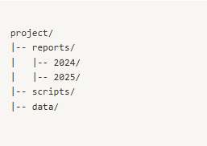

# Task 1: File Management

For detailed explanations, check out my [Medium post on Task 1](https://medium.com/@zulfianarahmi4/dfg-linux-hands-on-homework-task-1-219d2cdb20ba)

### Task 1.1: Create a directory structure as follows:



```bash
mkdir -p project/reports/2024 project/reports/2025 project/scripts project/data
```

### Task 1.2: Create three empty files in the reports/2024 directory: `q1.txt, q2.txt, and q3.txt.`

```bash
touch reports/2024/q1.txt
touch reports/2024/q2.txt
touch reports/2024/q3.txt
```

### Task 1.3: Move `q1.txt` to the 2025 directory.

```bash
mv reports/2024/q1.txt reports/2025/
```

### Task 1.4: Copy `q2.txt` to the scripts directory and rename it as `analysis.txt.`

```bash
cp reports/2024/q2.txt script/analysis.txt
```

### Task 1.5: List all files in the `reports/2025` directory using ls and log the output to `file_list.log.`

```bash
ls reports/2025 > file_list.log
```

### Task 1.6: Display the contents of `q3.txt` using cat and append "Task Completed" to the file.

```bash
echo "Task Completed" >> reports/2024/q3.txt
cat reports/2024/q3.txt
```

### Task 1.7: Use tree to display the directory structure of the project directory and save the output to `structure.log.`

```bash
tree ~/Documents/project > structure.log
```

### Task 1.8: Remove the `scripts/analysis.txt` file and confirm its deletion by listing the contents of the scripts directory.

```bash
rm scripts/analysis.txt
ls scripts
```

### Task 1.9: Copy the entire project directory to a new directory named `project-old.`

```bash
cp -r ~/Documents/project ~/Documents/project-old
```

### Task 1.10: Delete the original project directory.

```bash
rm -ri ~/Documents/project
```

### Task 1.11: Create a large file (5GB) in the data directory using dd or truncate. Name it `large_file.dat`.

```bash
truncate -s 5G ~/Documents/large_file.dat
```

## This challenge (Task 1) involves:

- Wrong path: For example, using ~/project when the actual directory is ~/Documents/project.
- Permission issue: Not having write access to the target directory.
- Command typo: Mistyping the file name or command (e.g., typing scrpt instead of scripts).

## The lesson:

- Familiarization with command line tools in Linux.
- Understanding the file/directory manipulation workflow.
- Recognizing the importance of planning and verification before deleting data
