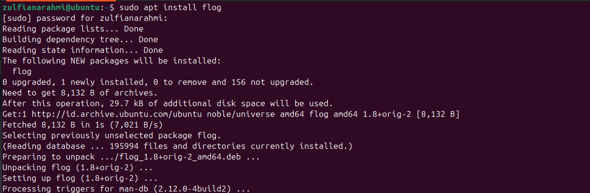

# Task 2: Output and Text Manipulation

## Prerequisites

- Install `flog` to generate fake logs.

```bash
# Install flog (if not installed yet)
gem install flog
```



## Task 2.1: Generate Fake Logs

```bash
flog --entries 2000 > access.log
```

---

## Task 2.2: Extract Unique IP Addresses

```bash
awk '{print $1}' access.log | sort | uniq
```

---

## Task 2.3: Count IP Address Occurrences

```bash
awk '{print $1}' access.log | sort | uniq -c > ip_counts.txt
```

---

## Task 2.4: Filter Log Entries with Status Code 404

```bash
grep ' 404 ' access.log > errors.log
```

---

## Task 2.5: Replace 'Mozilla' with 'BrowserX'

```bash
sed 's/Mozilla/BrowserX/g' access.log > access_modified.log
```

---

## Task 2.6: Extract Log Entries for a Specific Date

```bash
grep '2025-01-01' access.log > specific_date.log
```

---

## Task 2.7: Calculate Total Bytes Transferred

```bash
awk '{sum += $10} END {print sum}' access.log
```

---

## Task 2.8: Find IP Address with Most 404 Errors

```bash
grep ' 404 ' access.log | awk '{print $1}' | sort | uniq -c | sort -nr | head -n 1 > top_404_ip.txt
```

---

## Task 2.9: Anonymize IP Addresses

```bash
sed -E 's/^[0-9]+\.[0-9]+\.[0-9]+\.[0-9]+/ANONYMIZED_IP/' access.log > access_anonymized.log
```

---

## Task 2.10: Count Log Entries with Status Code 500

```bash
grep ' 500 ' access.log | wc -l
```
